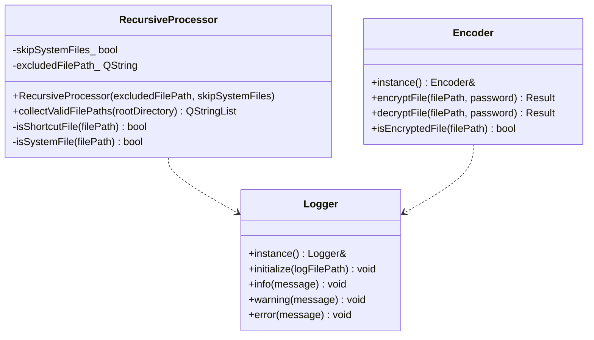

# Recursive File/Folder Encryptor

Консольное приложение для лабораторной работы №1 ("Разработка средств защиты информации").

## Технологии

- C++17
- CMake >= 3.12
- Qt 5.12 (`Qt5::Core`)
- OpenSSL (по умолчанию требуется 3.3.6)

## Структура проекта

- `main.cpp` — CLI, запуск обработки, вывод статистики
- `logger/` — модуль логирования (`Logger`, singleton)
- `logger/src/` — реализация модуля логирования
- `crypto_manager/` — модуль шифрования/дешифрования (`Encoder`, singleton)
- `crypto_manager/src/` — реализация криптомодуля (AES-256-GCM)
- `recursive_stepper/` — модуль рекурсивного обхода (`QDirIterator`)
- `recursive_stepper/src/` — реализация рекурсивного обходчика
- `cmake/` — служебные CMake-скрипты
- `*/test/` — каталоги под unit-тесты (структурно совместимы с референсом)
- `testing/` — тестовая директория с вложенными файлами для ручной проверки работы программы
- `.clang-format` — стиль Google

## UML Архитектура (Mermaid)



## Сборка

```bash
cmake -S . -B build
cmake --build build -j
```

Если в окружении нет OpenSSL 3.3.6, но нужна локальная проверка:

```bash
cmake -S . -B build -DOPENSSL_REQUIRED_VERSION=3.0.0
cmake --build build -j
```

## Запуск

```bash
./build/recursive_encryptor --mode encrypt --directory /path/to/dir --password secret
./build/recursive_encryptor --mode decrypt --directory /path/to/dir --password secret
```

Дополнительно можно указать путь к лог-файлу:

```bash
./build/recursive_encryptor --mode encrypt --directory /path/to/dir --password secret --log /path/to/encryptor.log
```

## Особенности реализации

- Алгоритм: AES-256-GCM (OpenSSL EVP API)
- Ключ: PBKDF2-HMAC-SHA256
- Рекурсивный обход: `QDirIterator` с поддержкой подпапок любой вложенности
- Пропуск и логирование событий:
  - пустые файлы
  - ярлыки (`*.lnk`, `*.url`)
  - символьные ссылки
  - системные файлы (Windows: `FILE_ATTRIBUTE_SYSTEM`, Unix: спец-пути `/proc`, `/sys`, `/dev`)
  - служебный лог-файл приложения
- Безопасная запись: `QSaveFile` (атомарная замена файлов)
- Подробные Doxygen-комментарии в заголовочных файлах
